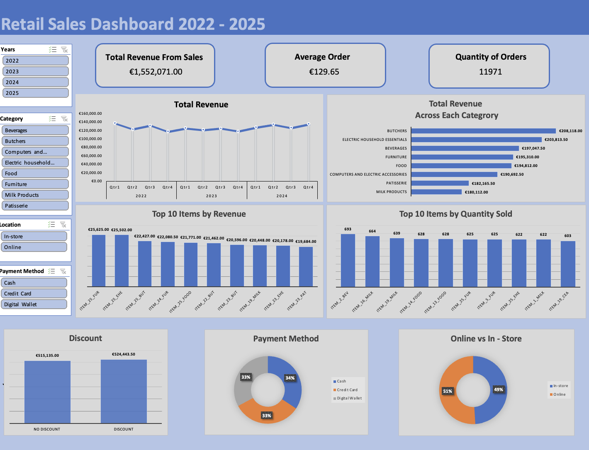

# 🧹 Retail Store Sales Data Cleaning & Excel Dashboard

## 📘 Overview

This project focuses on cleaning and analyzing a retail sales dataset (12,000+ transactions) from Kaggle, transforming messy data into a structured, validated, and interactive Excel dashboard.
The goal was to practice real-world data cleaning and visualization while uncovering actionable insights into sales performance, customer spending behavior, and category-level trends using Excel tools such as PivotTables, XLOOKUP, and Conditional Formatting.

**Dataset:** [Retail Store Sales (Dirty for Data Cleaning)](https://www.kaggle.com/datasets/ahmedmohamed2003/retail-store-sales-dirty-for-data-cleaning)  
**Tool Used:** Microsoft Excel (Mac)  
**Total Records:** 12,575  
**Removed Records:** 604 (≈4.8%)

---
## 🛠️ Tools & Skills
- Microsoft Excel (Data Cleaning, PivotTables, Charts, Dashboard Design)
- Data Validation & Consistency Checks
- XLOOKUP, Conditional Formatting, Calculated Fields
- Data Visualization & Business Insight Reporting

## 🧾 Dataset Description
The dataset contains retail transaction data including:
- Transaction ID
- Customer ID
- Category  
- Item  
- Price per Unit  
- Quantity  
- Total Spent  
- Payment Method 
- Location 
- Transaction Date
- Discount Applied 

---

## 🧼 Data Cleaning Summary

| Column | Missing Values | Action Taken |
|---------|----------------|---------------|
| Quantity | 604 | Rows removed (same rows with blanks as Total Spent) |
| Total Spent | 604 | Removed same rows as Quantity |
| Price per Unit | 609 | Filled using Total Spent ÷ Quantity |
| Item | 1,213 | Inferred using Category & Price |
| Discount Applied | 4,199 | Left blank as unclear meaning |

---

## 🧮 Cleaning Highlights

- Converted dates to `YYYY-MM-DD`  
- Set proper data types and formatting  
- Checked for duplicates  
- Filled “Price per Unit” blanks using:

```excel
=[Total Spent]/[Quantity]
```


- When filtering for Category and Price all non blank Item cells have the same Item name for a particular price (no two items in the data set had the same price), therefore it can be reasonably assumed the blanks in Item Name should have that same name as the other items for that price and category.

- Used XLOOKUP to fill missing Item names:

```
=IF(D2<>"", D2, XLOOKUP(1,(C:C=C2)*(E:E=E2)*(D:D<>""),D:D))
```

- Removed 604 rows from the data that had both Quantity and Total Spent missing as amounted to less than 5% of Dataset
 


## 📊 Dashboard Insights




- In general the revenue is relatively equally  spread throughout the Categories,  Items and time periods. The  highest revenue category is  **Butchers( €208,118.00)** while the lowest revenue category **Milk Products(€180,112.00)** a  difference  of 13.5%. Sales are also equally spread throughout the different payment options and whether the sales are online or instore. However, digging a little deeper, some key insights become apparent:

### Key Insights
### 🥩 Butchers
- Highest earning category but trending down
- 📉 Revenue down **16.8%** (2022 vs 2024)
- 3 of Top 5 customers reduced spending (up to **42%** drop)


- Butchers:  4 of the bottom 5 customers for spending recorded drops in spending, ( up to **61.48%** drop)

### 🍽️ Food
- 📈 Revenue up **15.6%** (2022 vs 2024)

- 💪 Strong growth across all of the top 5 customers for spending comparing the years 2022 and 2024.  2 Top customers increased spending > **80%** 

### 🥤 Beverages
- 📈 Revenue increased steadily **+16.76%** (2022 vs 2024).
- 💪 Growth was driven by top customers all 5 of the top five increasing their yearly spend

🧁 **Patisserie**
- 📈 Revenue up **16.76%** (2022 vs 2024)

- Patisserie: 4 of the top 5 spenders recorded a drop in spending ranging from around **20% to 35%**

 

## 💡 Key Takeaways & Recommended Actions

### 🥩 Butchers – Declining Performance
**Insight:** Revenue trending down despite being top earner.  
**Actions:**

- Re-engage top customers with personalized offers and loyalty rewards.

- Conduct a deep dive into pricing, competition, and stock issues.

- Launch retention campaigns targeting high-value but declining customers.

### 🍽️ Food – Sustained Growth

**Insight:** Strong performance and expanding customer spend base.  

**Actions:**

- Identify and replicate success factors (e.g., product mix, promotions).

- Use Food’s growth model to strengthen underperforming categories.

- Build stronger partnerships with high-growth customers through incentives or exclusives.

### 🧁 Patisserie – Customer Spend Decline

**Insight:** Losses concentrated among top customers suggest reduced engagement.

**Actions:**

- Gather customer feedback to understand drop-off reasons.

- Refresh product range or introduce seasonal lines to reignite interest.

- Implement retention campaigns targeting high-spend customers showing decline.

### ☕ Beverages – Consistent Growth

**Insight:** Stable year-on-year growth and steady customer retention.  

**Actions:**

- Maintain current strategy and marketing approach.

- Explore upselling or bundling with complementary categories.

- Slightly increase marketing investment to maximize steady growth momentum.

## 🎯 Results & Learnings
- Built an interactive Excel dashboard analyzing 12,000+ transactions
- Identified customer-spending trends and category performance shifts
- Strengthened data cleaning, analysis, and visualization skills in Excel
- Enhanced ability to derive actionable business insights from raw data
