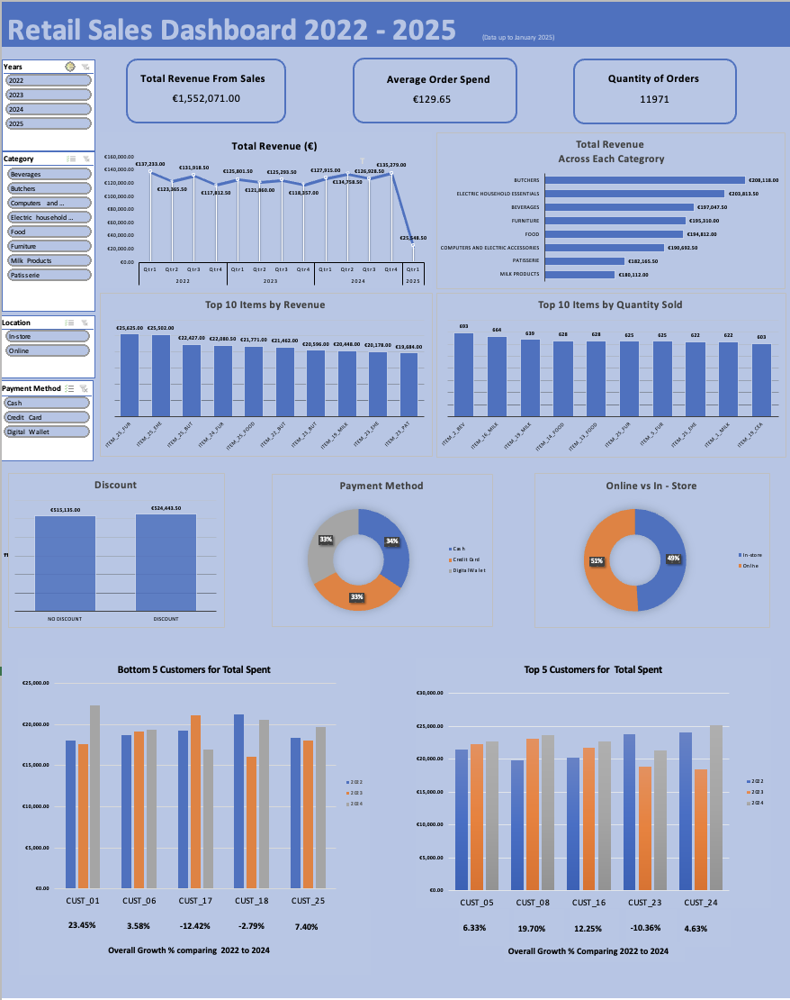

# 🧹 Retail Store Sales Data Cleaning & Excel Dashboard

## 📘 Overview
This project focuses on cleaning and analyzing a messy retail sales dataset from Kaggle, transforming it into a structured, validated, and interactive Excel dashboard.  
The aim was to practice real-world data cleaning, explore sales performance by product category, and develop a clear, data-driven visualization of retail trends.

**Dataset:** [Retail Store Sales (Dirty for Data Cleaning)](https://www.kaggle.com/datasets/ahmedmohamed2003/retail-store-sales-dirty-for-data-cleaning)  
**Tool Used:** Microsoft Excel (Mac)  
**Total Records:** 12,575  
**Removed Records:** 604 (≈4.8%)

---

## 🧾 Dataset Description
The dataset contains retail transaction data including:
- Transaction ID
- Customer ID
- Category  
- Item  
- Price per Unit  
- Quantity  
- Total Spent  
- Payment Method 
- Location 
- Transaction Date
- Discount Applied 

---

## 🧼 Data Cleaning Summary

| Column | Missing Values | Action Taken |
|---------|----------------|---------------|
| Quantity | 604 | Rows removed (same rows with blanks as Total Spent) |
| Total Spent | 604 | Removed same rows as Quantity |
| Price per Unit | 609 | Filled using Total Spent ÷ Quantity |
| Item | 1,213 | Inferred using Category & Price |
| Discount Applied | 4,199 | Left blank as unclear meaning |

---

## 🧮 Cleaning Highlights

- Converted dates to `YYYY-MM-DD`  
- Set proper data types and formatting  
- Checked for duplicates  
- Filled “Price per Unit” blanks using:

```excel
=[Total Spent]/[Quantity]
```


- When filtering for Category and Price all non blank Item cells have the same Item name for a particular price (no two items in the data set had the same price), therefore it can be reasonably assumed the blanks in Item Name should have that same name as the other items for that price and category.

- Used XLOOKUP to fill missing Item names:

```
=IF(D2<>"", D2, XLOOKUP(1,(C:C=C2)*(E:E=E2)*(D:D<>""),D:D))
```

- Removed 604 rows from the data that had both Quantity and Total Spent missing as amounted to less than 5% of Dataset
 


## 📊 Dashboard Insights




- In general the revenue is relatively equally  spread throughout the Categories,  Items and time periods. The  highest revenue category is  Butchers with €208,118,00 while the lowest revenue category Milk Products has €180,112, a  percetage difference  of 13.5%. Sales are also equally spread throughout the different payment options and whether the sales are online or instore. However digging a little deeper some key insights become apparent :

#### Key Insights

- Butchers: Highest earning category but trending down. Qrt 1 2022 €20,999.50  Qrt 1 2024 €16,346.00. Yearly revenue down from €79,395.50 in 2022 to €66,067.50 in 2024, a drop of 16.78 %

- Butchers:  3 of the Top 5 customers for spending recorded a drop in spending comparing the years 2022 and 2024. Cust_17 had a very large 42.38% drop in spending while Cust_4 and Cust_10 had a drop of around 17%

- Butchers:  4 of the bottom 5 customers for spending recorded drops in spending, with Cust_20 in particular having a drop of 61.48%

- Food: qrt 1 2020 € 13,833.50 qrt1 2024 €15,744.50. Yearly revenue up from €57,026.00 in 2022 to €65,914.50 in 2024,  an increase of 15.59%

- Food: Strong growth across all of the top 5 customers for spending comparing the years 2022 and 2024.  Cust_7 increased by 103.52%  and Cust_ 13 by 88.75%.

- Patisserie: 4 of the top 5 spenders recorded a drop in spending ranging from around 20% to 35%

- Beverages: Growing steadily  Qrt 1 2022 €16,734 Qrt 1 2024 €17,543. Yearly revenue up from €63,555 in 2022 to €74,205.50  an increase of 16.76%
 

## 💡 Key Takeaways & Recomended Actions

 🥩 **1. Butchers Category** – Declining Performance. 

Revenue is trending down despite being the top earner.

Actions: 

- Re-engage top customers with personalized offers and loyalty rewards.

- Conduct a deep dive into pricing, competition, and stock issues.

- Launch retention campaigns targeting high-value but declining customers.

🍽️ **2. Food Category** – Sustained Growth

Strong performance and expanding customer spend base.  

Actions:

- Identify and replicate success factors (e.g., product mix, promotions).

- Use Food’s growth model to strengthen underperforming categories.

- Build stronger partnerships with high-growth customers through incentives or exclusives.

🧁 **3. Patisserie Category** – Customer Spend Decline

Losses concentrated among top customers suggest reduced engagement.

Actions:

- Gather customer feedback to understand drop-off reasons.

- Refresh product range or introduce seasonal lines to reignite interest.

- Implement retention campaigns targeting high-spend customers showing decline.

☕ **4. Beverages Category** – Consistent Growth

Stable year-on-year growth and steady customer retention.  

Actions:

- Maintain current strategy and marketing approach.

- Explore upselling or bundling with complementary categories.

- Slightly increase marketing investment to maximize steady growth momentum.
